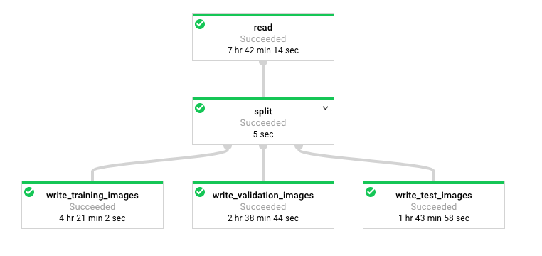

# Hello Dataflow Image Preprocessing!

This tutorial walks through the main steps of 2b and 3 in the cats ML example.
It goes over some of the higher level concepts and discusses in some detail how
the dataflow pipelines are built.

## Quick Intro to Beam Pipelines

Cloud Dataflow is a service that runs Apache Beam pipelines on GCP. A beam
pipeline reads entries from a source, and streams data through numerous
processing elements. In python, a processing element is marked by a **unique**
string name (preceded by a "|") and a corresponding transformation process
(preceded by a ">>"). A single pipeline will generally follow this pattern:

```
with beam.Pipeline(options=pipeline_options) as p:
  (p
   | 'step_1_component_name'
   >> do_step_1()
   | 'step_2_component_name'
   >> do_step_2()
   ...
   | 'step_3_component_name'
   >> do_step_n()
   )
```

where `with beam.Pipeline(...) as p` creates a new pipeline, and each `do_step`
corresponds to an Apache beam processing component.

When exiting from the `with beam.Pipeline...` block, the pipeline will execute.
Before then, the components that are merely being defined within the block as
part of the pipeline architecture. Essentially, pipelines are *lazy*. They wait
for you to write code for all of the processing steps, and then they execute.
We will show some real examples of this behavior below in step 2b and step 3.

## Step 2b: Preprocessing images

Preprocessing is an important step for both traditional and deep ML.

In traditional ML, in order to do meaningful feature extraction where resulting
feature vector lengths are equal, images often have to be reshaped and resized
to a specific size. For example, if you wanted to create a feature out of the
mean values of pixels over 8x8 grids along each image, different image sizes
would lead to different feature lengths.

In deep ML on images, convolutional neural networks (CNNs) are often used as
they can learn both local and global scale model layers, which can then be
aggregated to make an accurate prediction of the image content. CNNs also
require the same image sizes, since they are architected to learn models whose
inputs are of a fixed dimension.

Step 2b performs multiple steps to ensure that our images
are in a centralized location (Cloud Storage), and that they have been resized
in a manner that is satisfactory for our model building.

### Understanding the Beam Pipeline in Step 2b

In the `step_2b_get_images.py` file, you see the following pipeline:

```
  bq_source = bigquery.BigQuerySource(query=query)

  with beam.Pipeline(options=pipeline_options) as p:
    _ = (p
         | 'read_rows_from_cat_info_table'
         >> beam.io.Read(bq_source)
         | 'fetch_images_from_urls'
         >> beam.Map(fetch_image_from_url)
         | 'filter_bad_or_absent_images'
         >> beam.Filter(filter_bad_or_missing_image)
         | 'resize_and_pad_images'
         >> beam.Map(resize_and_pad,
                     output_image_dim=known_args.output_image_dim)
         | 'write_images_to_storage'
         >> beam.Map(write_processed_image,
                     output_dir=output_dir)
         )
```

We will discuss each step below.

#### 'read_rows_from_cat_info_table'
The **'read_rows_from_cat_info_table'** step reads rows from a source, in this
case, a bigquery source. The bigquery source is defined by a sql query. In the
default setup for the tutorial, the query passed into the BigQuerySource is:

```
SELECT ROW_NUMBER() OVER() as index,
       original_url,
       label,
       randnum
FROM [dataset.catinfo]
```

The output of reading this source is a collection of dictionary elements, where
each row read from the query is converted to a dictionary, with each key
corresponding to a column name, and each value corresponding to the value in
that column. A row from the bigquery source would look something like this:

```
{
  'index': 1234,
  'original_url': http://path.to.picture.com/cat.jpg,
  'label': 1,
  'randnum': 0.2349
}
```

####'fetch_images_from_urls'

This step is a known as a **transformation** step and follows the syntax:

```
beam.Map(some_fn())
```

where `some_fn()` is a function that takes, as input, an element from the
pipeline, and returns, as output, an element to transmit downstream to the next
processor. In this step, `some_fn()` is given by

```
def fetch_image_from_url(row):
  # return a dict with the url field replaced with actual image data
```

The function parses out the 'original_url' field from the input row, downloads
the actual image from the url, and decodes it into a raw 3d numpy tensor (width
x height x 3 colors). The function then returns all of the other entries, but
replacing 'original_url' with the entry {'img': [raw_img_tensor]}. If the image
does not exist, it will return nothing, represented by a python "None" object.

####'filter_bad_or_absent_images`

Obviously, we don't want to process any missing images ("None" objects) from the
previous step. This step is known as a *filter* step and follows the syntax:

```
beam.Filter(boolean_fn())
```

where `boolean_fn()` takes as input an element from the pipeline, and returns
a True (if the element should pass on to the next step) or False (if the element
should be removed) value. In this step, the filter function is:

```
def filter_bad_or_missing_image(img_and_metadata):
  # return False if bad/missing image, True otherwise
```

`filter_bad_or_missing_image` checks for two things:
* If the datum is a "None" object, remove it from the pipeline.
* If the image in the datum meets certain specifications that match the "missing
image" on Flickr, remove it from the pipeline.
* Otherwise, pass the datum on to the next step.

####'resize_and_pad_images'

This is the most involved step in the tutorial. In order to run our machine
learning algorithms to run properly in subsequent steps, the output image has to
be a square image with 128 pixels per side. If the input image happens to be
wider than it is tall, this step will shrink the image proportionally such that
it is at most 128 pixels wide. Then, it will pad the top
and bottom of the image equally with "zeros", or black pixels, until the result
is a perfect 128x128 square. Likewise, if the image is taller than it is wide,
it will perform the same operation but pad the left and right with zeros.

This is also a transform step, but notice that the beam.Map() takes in two
arguments, i.e.:

```
beam.Map(resize_and_pad,
         output_image_dim=known_args.output_image_dim)
```

beam.Map() can actually take an indefinite number of arguments, but the first
element must always be a function. Every additional element is known as a *side
input* and gives the pipeline writer the flexibility to pass parameters from
outside the pipeline into the function. This becomes clear when we inspect the
`resize_and_pad()` function, as we see that the second argument in beam.Map(),
i.e. `output_image_dim`, is also an argument in resize_and_pad().

```
def resize_and_pad(img_and_metadata, output_image_dim=128):
  # returns dict with resized image
  # default size is 128 if no side input provided
```

####'write_images_to_storage'


The final step is also a *transform* step which writes the output image to a
custom-named file on Cloud Storage. The name follows the format:

```
[index]_[randnum_times_1000]_[label].png
```

where index is prepended with 0s such that it is always at least 6 digits long,
and randnum_times_1000 is an integer between 0 and 999 obtained by multiplying
the random number by 1000 (and stripping the fraction if necessary).

There are a couple interesting features to note about this function. First, the
function used here also has a side input `output_dir`:

```
def write_processed_image(img_and_metadata, output_dir)
```

More importantly, because this is the last transformation in the pipeline, there
is no need for this function to return an output, as there are no further steps
to ingest the output data. Instead, the function takes the processed image and
calls the beam.FileSystems API to write the image data into cloud storage.

For additional reading, see
[detailed documentation for writing beam pipelines here.](https://beam.apache.org/documentation/programming-guide/)

### Running Step 2b

A sample dataflow run command can be found in `run_step_2b_get_images.sh`:

```
python -m step_2b_get_images \
  --project $PROJECT \
  --runner DataflowRunner \
  --staging_location gs://$BUCKET/$IMAGE_DIR/staging \
  --temp_location gs://$BUCKET/$IMAGE_DIR/temp \
  --num_workers 50 \
  --worker_machine_type n1-standard-4 \
  --setup_file ./setup.py \
  --region $DATAFLOW_REGION \
  --dataset dataset \
  --table $TABLE \
  --storage-bucket $BUCKET \
  --output-dir $IMAGE_DIR/all_images \
  --output-image-dim 128 \
  --cloud
```

Note that each argument is either pipeline-runner (in this case, DataflowRunner)
specific, or a custom argument that we parse out in `step_2b_get_images.py`. We
have organized the command such that pipeline-runner specific arguments come
first, followed by project-specific arguments

**Runner-specific arguments**

These arguments are implicitly parsed by the runner that is specified when
running the job, i.e. DataflowRunner.

* **--project:** required for read/write permissions and dataflow billing
* **--runner:** for GCP, this is always DataflowRunner
* **--staging_location:** locations for uploading build files to transfer to Cloud
Dataflow workers
* **--temp_location:** location for writing temporary files during pipeline
processing. Often used to store the end output of a pipeline before moving data
to appropriate destination location.
* **--num_workers:** number of Cloud Dataflow VMs/workers to spin up
* **--worker_machine_type:**
[Cloud compute engine VM types](https://cloud.google.com/compute/docs/machine-types)
with different amounts of memory and cpus
* **--setup_file:** a python file that is run by each worker to setup its
environment and libraries. For instance, our project's `setup.py` file requires
workers to install opencv2 libraries and python packages.
* **--region:**
[the region that dataflow will run on](https://cloud.google.com/dataflow/docs/concepts/regional-endpoints#supported_regional_endpoints)

**Step 2b specific arguments**

These arguments are parsed out in the `run()` function at the bottom of the
`step_2b_get_images.py` file using the command line argument parser library
`argparse`.

* **--dataset:** the dataset where the catinfo table is located
* **--table:** "catinfo"
* **--storage-bucket:** cloud storage bucket name to write output images to
* **--output-dir:** the directory to write output images to in the bucket
* **--output-image-dim:** width/height of the output images
* **--cloud:** Currently, a required argument that tells us to write everything
to cloud. The only case for removing this is for experts to debugging python
code locally using a small sample with "DirectRunner". (In the future, we will
provide local run scripts and tests for debugging.)

### Visualizing Step 2b

After you run step 2, you can go to the
[Dataflow Console](https://console.cloud.google.com/dataflow)
and check the progress of your graph. You should see all the steps mentioned
above organized as a linear pipeline like this:

<div align="center">

</div>

Notice that each step is running simultaneously as in an assembly line. Once an
entry is read from bigquery, it is passed to the next step (fetching the image),
and once that is completed, it is passed to subsequent steps. The preprocessed
images will begin to show up in your storage bucket as soon as they run through
the pipeline!

Furthermore, you might notice images being written "out of order". This is
because of massive parallelization, where multiple machines read different
subsets of the big query table and start processing these elements using the
pipeline architecture. Pretty cool right?

Finally, you may notice that each component takes a different amount of "time".
This time may look scary, but it is actually the total amount of processor time.
If you have 200 processors, you would divide the number by 200 to get the
average time spent per processor. Hence, the actual time to run the pipeline on
cloud may only be 20 minutes long, but if you were to run it on your own
computer instead, it could take over a day!

## Step 3: Splitting images

In this step, we would like to split the set of images into training,
validation, and testing image sets. How can we do this?

Now that we've walked through a pipeline example in step 2b, we will discuss an
additional beam concept called *partitioning*. A linear pipeline, like that in
step 2b, will send all of its data from the first through the last step.
However, suppose we want to write our image set to multiple destination
locations. We can split the original pipeline (after some processing step)
into multiple pipelines. These multiple pipelines can then be processed
independently of each other (for example, if you want to do something with
training images that you do not want to do with validation), and written into
different destination locations.

Here is a snippet from the step 3 architecture. Note that `split_pipelines` is
the result of a partitioned pipeline, which returns a python list of pipelines.
These pipelines can then be looped through and invoked.

```
  with beam.Pipeline(options=pipeline_options) as p:
    # Read files and partition pipelines
    split_pipelines = (
        p
        | 'read' >> beam.io.Read(LabeledImageFileReader(source_images_pattern))
        | 'split'
        >> beam.Partition(
            generate_split_fn(split_fractions),
            len(split_fractions)
        )
    )

    # Write each pipeline to a corresponding output directory
    for partition, split_name_and_dest_dir in enumerate(
        zip(split_names, dest_images_dirs)):
      _ = (split_pipelines[partition]
           | 'write_' + split_name_and_dest_dir[0]
           >> beam.Map(write_to_directory,
                       dst_dir=split_name_and_dest_dir[1]))
```

### Running Step 3

Like step 2b, there are a number of required DataflowRunner arguments. The
additional arguments for step 3 are as follows:

* **--storage-bucket:** cloud storage bucket name from which to read and write
images
* **--source-image-dir:** source directory for the full iamge set
* **--dest-image-dir:** parent directory for split image sets
* **--split-names names of the split image sets. Combining
`dest-image-dir/split-name` gives the full name of the output directory.
* **--split-fractions:** space separated floating point numbers indicating what
fractions of the dataset to include in each split set
* **--cloud:** again, a required argument, removed only for expert debugging.
### Visualizing Step 3

Again, going to the Dataflow Console and clicking on the job will reveal a
pipeline that is split into 3 pipelines. Despite the "for" loop in the code
snippet above, which indicates that the pipeline processing components are
created sequentially, none of these are actually executed at this point.
We are merely creating architecture (and *laziness* reigns supreme again!).
After exiting the `with beam.Pipeline...` block, the architecture is already
completed, and the pipelines and splits start running in parallel!

<div align="center">

</div>
